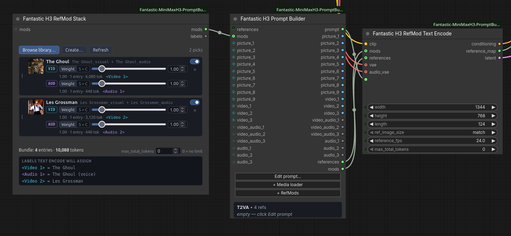
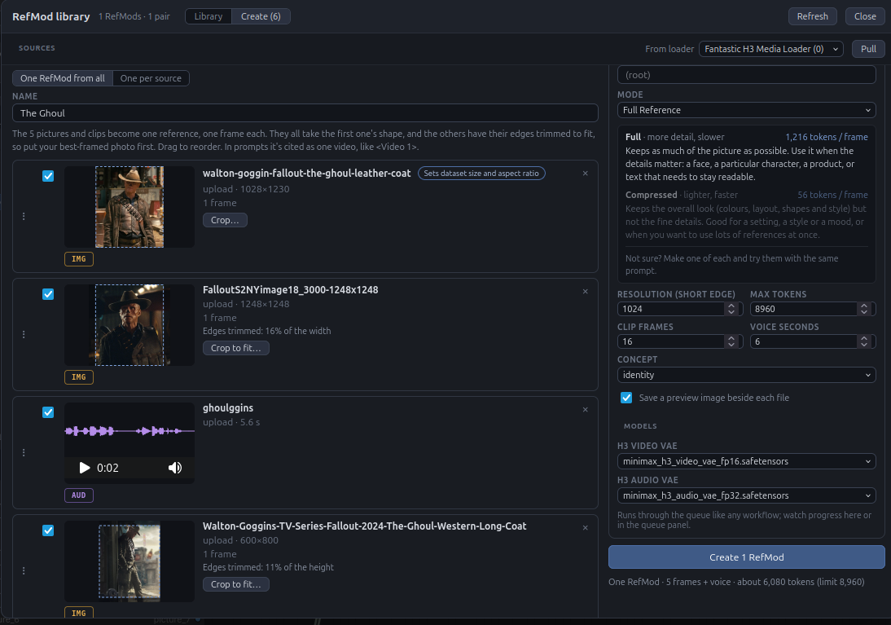
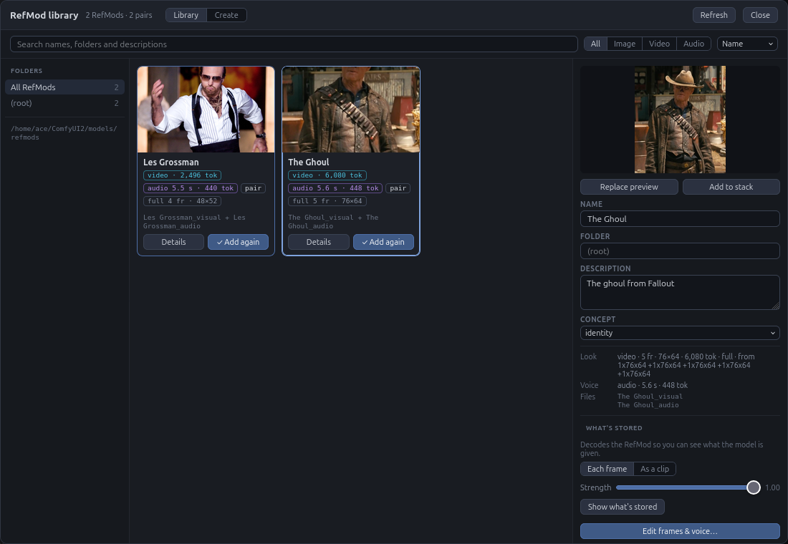
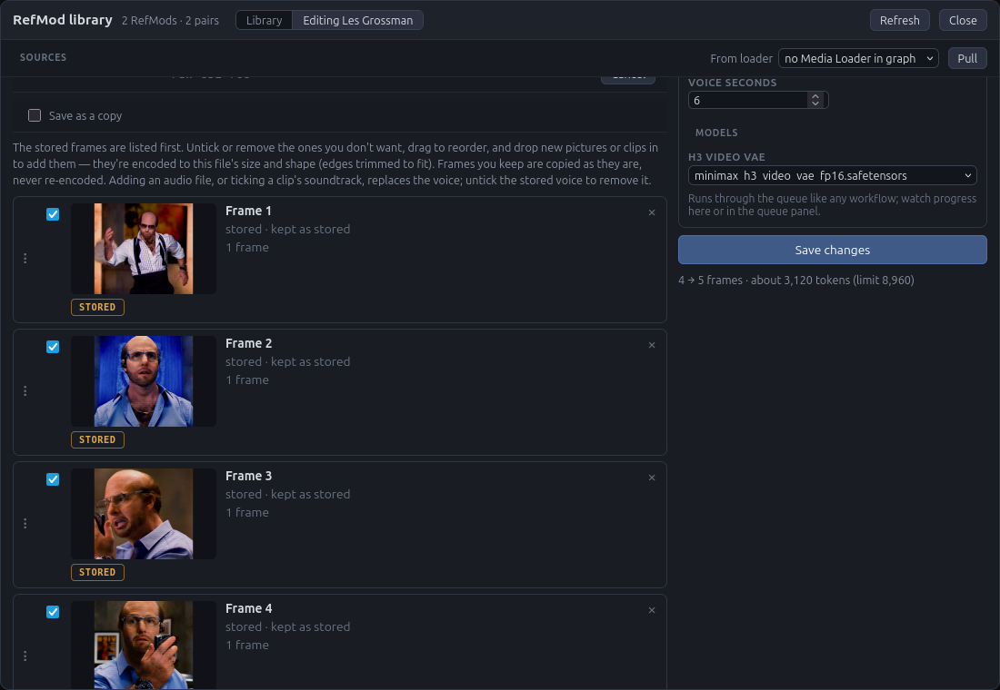
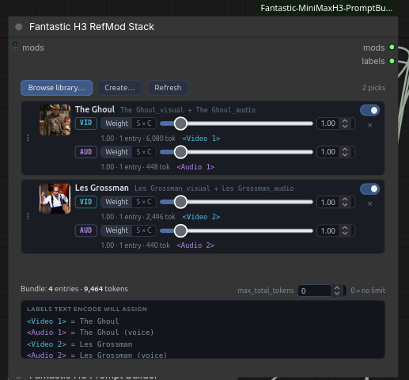
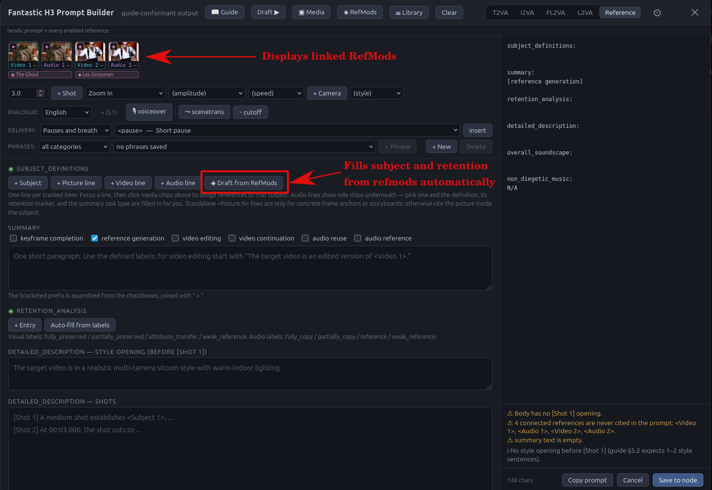
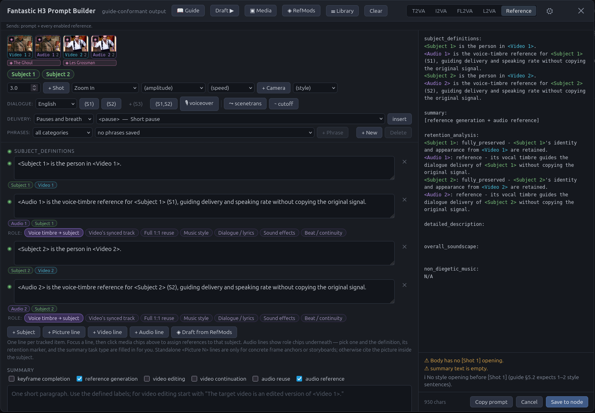

# RefMods: a how-to guide

A **RefMod** is a saved reference. It uses MiniMax H3's reference
functionality to save characters or concepts as a bundled package quickly.
Much like a LoRA, but without the training cost, and you can adjust your
dataset quickly and easily. Make one from a few photos of a
character, a clip of a place, or a recording of a voice, and it's ready to
drop into any prompt from then on. No re-uploading, no re-cropping, and it
looks the same every time you use it.


> **A note on the screenshots.** This guide came from
> [the original pack](https://github.com/Adudeguyman/ComfyUI-Fantastic-MiniMaxH3-PromptBuilder),
> where the prompt editor and the media panel are two separate nodes — a
> Prompt Builder and a Media Loader — and the pictures still show that
> layout. Here they are one node, **MiniMax H3 Prompt Studio**, with the
> media panel built into it. The text below is written for Prompt Studio;
> where a picture shows two nodes, read them as the one you have. Nothing
> about RefMods themselves differs.

---

## Contents

- [Before you start](#before-you-start)
- [Quick and easy setup](#quick-and-easy-setup)
- [Making a RefMod](#making-a-refmod)
- [Saving and organising](#saving-and-organising)
- [Editing a RefMod](#editing-a-refmod)
- [Using RefMods in a prompt](#using-refmods-in-a-prompt)
- [Tips and fixes](#tips-and-fixes)

---

## Before you start

You need:

- **A ref2va H3 model.** RefMods are references, and ref2va is the model
  that was trained on references. The standard fl2va model will still run
  with them, but it wasn't trained to use them, so expect weaker results.
  However, MiniMax has admitted there are faults with the open-weight
  ref2va model, so we strongly encourage using a fl2va/ref2va hybrid model
  that enables reference capabilities with fl2va quality. These are
  **direct drop-ins** for ref2va workflows, and do not require any special
  nodes or workflow modifications to use, just select a hybrid model
  instead of a ref2va model. Testing was done using the "20-49" model from
  this repo:
  <https://huggingface.co/smhfacct/Minimax-H3-fl2va-ref2va-hybrid-models>
- **The H3 video VAE** for anything with pictures, and **the H3 audio
  VAE** for voices.

Your RefMods are saved in `ComfyUI/models/refmods`. You never have to go
there yourself, but it's handy to know if you want to back them up or
share them.

There are two ready-made workflows in `example_workflows`. Load one, pick
your model files, and everything below is already wired up:

- **MMH3_RefMod_Vanilla_Stack_Example.json** uses only this pack and
  ComfyUI's own nodes.
- **MMH3_RefMod_Fully_Fantastic_Example.json** is the same chain with the
  Fantastic LoRA loader and seed nodes from the
  [comfyui-fantastic-loras](https://github.com/Adudeguyman/comfyui_fantastic-loras)
  pack, so install that first.

---

## Quick and easy setup

Open **Edit prompt…** on the **Prompt Studio** node and click **◈ RefMods**
in the editor's header.

That adds a **RefMod Stack** next to Prompt Studio and wires it in, then
opens the stack's own panel. If your workflow already has a **RefMod Text
Encode**, it connects that too. From here, everything happens inside
windows. You rarely need to touch the wires again.



### The nodes

- **MiniMax H3 RefMod Stack** holds the RefMods you've picked for this
  prompt.
- **MiniMax H3 Prompt Studio** is where you write the prompt and load your
  reference media. It shows your RefMods as chips and passes them on. (In
  the picture above, this is the Prompt Builder and the Media Loader
  together.)
- **MiniMax H3 RefMod Text Encode** takes the place of the native
  **MiniMax H3 Reference to Video** node. Use one or the other, not both.

The Text Encode node does everything Reference to Video did, and it
understands RefMods:

- Wire the H3 **clip** and **vae** into it as you would for Reference to
  Video, plus the **audio_vae** if any of your references have a voice.
- Prompt Studio's **prompt**, **mods** and **references** outputs go to the
  inputs of the same names. **◈ RefMods** makes those connections for you
  when the Text Encode is already in the graph.
- Its **conditioning** goes to your sampler or guider, and its **latent**
  is the empty video to sample into, so you don't need a separate Empty
  Latent node either.
- **width**, **height**, **length** and **ref_image_size** are the same
  settings Reference to Video has, and they mean the same thing.
- **reference_map** is a text output listing every label and where it
  came from. Handy for checking with a preview node.

Media from Prompt Studio's own panel still works through it, so you can mix
RefMods with one-off pictures and clips in the same prompt. There's more on that
under [Using RefMods with regular media](#using-refmods-with-regular-media).

The RefMod Stack has three buttons at the top:

- **Browse library…** opens your saved RefMods.
- **Create…** opens the library straight on the Create tab.
- **Refresh** re-reads the folder if you added files by hand.

You can also open the stack from inside the prompt editor with the
**◈ RefMods** button in the header.

---

## Making a RefMod

Click **Create…** on the stack (or open the library and choose the
**Create** tab).



### 1. Add your media

Drag pictures, clips or audio files **anywhere onto the window**, or click
the drop area to pick files.

Already have them in **Prompt Studio's media panel**, trimmed and cropped
the way you like? Choose it under **From loader** and click **Pull**. Or
right-click the Prompt Studio node and pick **RefMod library**.

### 2. Choose one RefMod or several

- **One RefMod from all** (the default) combines everything into a single
  RefMod. Use this for several photos of the same character or place. More
  angles usually give a better likeness.
- **One per source** makes a separate RefMod from each item.

Give it a **name**.

### 3. Check the framing

When you combine photos, they all take the resolution and aspect ratio of
the **first one**:
portrait, landscape or square. The first photo is marked *Sets dataset
size and aspect ratio*.

- Put your best-framed photo at the top. Drag rows to reorder.
- Each preview shows what will be cut off, or how the photo gets squeezed
  to fit.
- To choose which part is kept instead of taking the middle, click
  **Crop to fit…** on a photo. The box is locked to the right aspect ratio, so
  just drag it over the part you want.

Hover over any preview to see it larger.

### Clips

A clip becomes a short run of stored frames, so the model can read a
motion or a look in movement. Two things to know:

- **Trim first.** Only the start of the clip is used, so trim it in the
  media panel (or with **Crop / trim…** here) to the moment you want.
- **Clip frames** is how many frames are taken from that start. H3 stores
  frames in chunks: 2 stored frames for anything up to 17, then 5 more for
  each further 17. So 22 frames store 7, 39 store 12, 56 store 17, and
  anything in between is cut down to the nearest of those. The line under
  the setting shows the result live, and each clip's row says which frames
  it uses.

Use **Full** for motion. Compressed keeps the overall look but not enough
detail to carry movement.

### 4. Full or Compressed?

- **Full** keeps as much detail as possible. Use it for faces, specific
  characters, products, or text that needs to stay readable. It makes
  generation slower.
- **Compressed** keeps the overall look (colours, layout, shapes, style)
  but not the fine detail. It's much lighter, and good for settings,
  styles, moods, or when you want lots of references at once.

Not sure? Make one of each and try them with the same prompt.

### 5. Voices

Add an audio file, or tick **include its soundtrack as a voice** on a
clip. The voice is saved alongside the look as part of the same RefMod.
**Voice seconds** sets how much of the recording is kept, counted from the
start. A clean recording of just the one voice, without music or
background noise, gives the best result.

### 6. Create

Pick the **H3 video VAE** (and **audio VAE** for voices) under Models, then
click **Create**.

The line under the button tells you how big the result will be. If it's
over your token limit, the button stays locked and tells you why. Lower
the resolution, switch to Compressed, raise the limit, or leave out a
source.

Creating runs in the ComfyUI queue like any other job, so you can watch
it there. When it's done, the new RefMod appears in the library.

---

## Saving and organising

Everything you create is saved automatically. Open **Browse library…** to
see it all.



- **Search** by name, folder or description.
- Filter by **Image / Video / Audio** and sort by name, size or newest.
- **Folders** on the left list any subfolders you've sorted RefMods into
  (for example `characters` or `places`). Click one to show only what's in
  it. You can pick a folder when you create a RefMod, or move one later
  from its details panel.

Click **Details** on a card to open its panel. From there you can:

- **Rename** it, or type a folder to move it (for example
  `characters/jodi`).
- Add a **description** and pick a **concept** (identity, clothing,
  background, voice, style…) so it's easy to find later.
- **Replace preview** to set a nicer thumbnail.
- **Delete** it. You'll be asked to click twice.

Click **Save changes** when you're done.

---

## Editing a RefMod

### See what's inside

In the details panel, click **Show what's stored**. It shows what the
model actually receives: each frame as a thumbnail (or played as a clip),
and the voice as an audio player. The **Strength** slider previews what a
lower weight looks like.

### Edit the RefMod's dataset

Click **Edit frames & voice…**. The RefMod opens in the Create tab, with
its saved frames listed first and marked **STORED**. Viewing or editing a
RefMod's dataset needs to run everything through a ComfyUI queue, so it
can take a moment to load individual elements, and it will wait until any
jobs already running in your ComfyUI queue have finished.



- **Remove a frame**: untick it, or click ×.
- **Reorder**: drag the rows.
- **Add photos or clips**: drop them in. They're automatically fitted to
  the RefMod's existing resolution and aspect ratio.
- **Replace the voice**: drop in a new audio file.
- **Remove the voice**: untick the stored voice row.

Editing never re-encodes what's already in a RefMod. Frames you keep are
copied exactly as they were, and only the photos, clips or voice you add
get encoded.

**RefMods made from a video clip:** a clip's frames were encoded together,
so they're marked **part of a clip**. Keep those together and in their
original order. Removing or reordering them can break up the motion and
make results drift, and the editor warns you if you do. To change a clip,
re-trim it and create the RefMod again. Adding or removing whole photos is
always safe.

### Save over it, or save a copy

- **Save changes** updates the RefMod.
- Tick **Save as a copy** and give it a new name to keep the original as
  it is and save your edited version alongside it.

**Cancel** leaves without changing anything.

---

## Using RefMods in a prompt

### Add them to the stack

In the library, click **Add** on a card. Cards already in the stack show
**✓ Add again**. Close the library and they're listed on the RefMod Stack.



Each row has:

- **A weight slider.** 1 is normal strength. Below 1 is softer. Above 1
  adds extra copies: 2 means two copies, which pushes the model harder
  toward that reference. Each extra copy makes generation heavier.
- **An on/off switch** to leave a RefMod out without removing it.
- **×** to remove it, and a handle to **drag** it up or down.

The bottom of the stack shows the total size and the labels the prompt
should use.

### Cite them in the prompt

Open **Edit prompt…** on Prompt Studio. Your RefMods show up as chips
with their labels, like **`<Video 1>`** and **`<Audio 1>`**. Click a chip
to insert its label.

- **Several photos combined into one RefMod appear as a `<Video>`**, not a
  `<Picture>`. That's expected. A single photo appears as a `<Picture>`.
- **A RefMod's voice is a separate `<Audio>`** label.
- **Copies share a label.** If you set a weight of 3, you'll see
  `<Video 1–3>`. Cite `<Video 1>` and that's enough.

In your subject definitions, write about them like any reference, for
example:

```text
subject_definitions:
<Subject 1> is the woman in <Video 1>.
<Audio 1> is <Subject 1>'s voice timbre reference.
```

Then give each one a line in retention analysis, saying how closely to
follow it:

```text
retention_analysis:
<Subject 1> (appears in [Shot 1]): fully_preserved - the woman's identity is retained.
<Audio 1>: reference - its vocal timbre guides the dialogue delivery of <Subject 1> without copying the original signal.
```

### Let the editor write them for you

You don't have to type these lines yourself. In **Reference** mode, click
**◈ Draft from RefMods** under `subject_definitions`. It writes a
definition line and a matching retention entry for every RefMod in your
stack, and ticks the right task types in the summary.





How each RefMod is written depends on its **concept**, the "what is this?"
setting you pick when creating it (or later, in its details panel in the
library):

- **A person or character** becomes a `<Subject>`: "`<Subject 1>` is the
  person in `<Video 1>`".
- **An outfit** or **a place** also becomes a `<Subject>`, described as the
  outfit or the environment.
- **A visual style** or **a pose or motion** gets its own line instead of a
  subject, saying what it guides and that its content isn't copied.
- **A voice** is tied to the subject from the same RefMod, with its own
  speaker ID. Singing voices, music styles, sound effects and ambience each
  get their own wording.

A RefMod's name and description are your own notes. They're never put
into the prompt.

**If a RefMod has no concept**, a small window asks what it is before
drafting. Leave **Save the answers to the library** ticked and you won't be
asked about that RefMod again.

**If you already have lines**, it asks what to do:

- **Add missing** keeps everything you've written and only drafts the
  RefMods that don't have a line yet. Use this after adding a new RefMod
  to the stack.
- **Start over** clears both sections and drafts them fresh.

It only drafts RefMods. Pictures, clips and audio from the media panel are
left for you to describe, since there's nothing saved about them.

The drafted lines are a starting point. Read them over and add the details
that matter for your shot, like hair, clothing or where the subject
appears.

The editor warns you if the prompt cites a label that isn't being sent, or
if a label is sent but never used.

### Using RefMods with regular media

You can use **loaded media** and RefMods together. Media from Prompt
Studio's panel is numbered first, then the RefMods after it. So one picture
in the panel plus a RefMod gives you `<Picture 1>` from the panel, then
`<Video 1>` and `<Audio 1>` from the RefMod. The editor's chips always show
the real numbers, so go by those.

**◈ RefMods** in the editor's header wires both halves through for you.

### Drafts

In **Draft mode**, the ◈ RefMods button edits the draft's own copy of the
stack. Your live stack isn't touched until you **Commit to Live**. The
draft banner tells you whether the draft is following the stack or has
its own RefMods.

---

## Tips and fixes

**Generation got really slow, or memory spikes.**
Every reference adds to the work on every step. The usual culprits are a
long video left in the media panel by accident, high weights (lots of
copies), or several Full RefMods at once. Try Compressed, lower the
weights, or trim clips down to the moment you actually need.

**The model seems to ignore my RefMod.**
Check that you're using a **ref2va** model, and that the prompt actually
cites the label (the editor warns you if it doesn't). A weight a little
above 1 can help.

**My photos came out cropped strangely.**
They all follow the first photo's resolution and aspect ratio. Reorder so your best-framed photo
is first, or use **Crop to fit…** on the others.

**No RefMods loaded** shows in the editor.
The stack is connected but empty, or every row is switched off. Add some
from the library.

**The chips say something isn't reaching the Text Encode.**
Click **◈ RefMods** in the editor's header again. It finishes any missing
connection.

**A voice sounds wrong or empty.**
Open **Show what's stored** and listen. If it's silent or very short,
edit the RefMod and drop the recording in again. Check that **Voice
seconds** isn't set very low.

**Can I share RefMods?**
Yes. Copy the files from `models/refmods` (the `.safetensors` files and
any preview image with the same name) to another ComfyUI's `models/refmods`
folder.

---

## Credits

The RefMod format, and the code that encodes and applies them, come from
[ComfyUI-MiniMaxH3Mod](https://github.com/Luisacaotica/ComfyUI-MiniMaxH3Mod)
by Luisa (luisacaotica), MIT License. This pack carries its own copy of
that runtime so RefMods work without the original installed, and the files
are the same format both ways: RefMods made here load in that pack, and
its RefMods load here. That includes the single-file **bundles** its
0.2.6 release can save: they show up in the library with a *bundle* badge,
using the first look and first voice inside, and can be used and inspected
here but not edited. The library's layout took cues from FranckyB's
[ComfyUI-H3RefMods](https://github.com/FranckyB/ComfyUI-H3RefMods).

